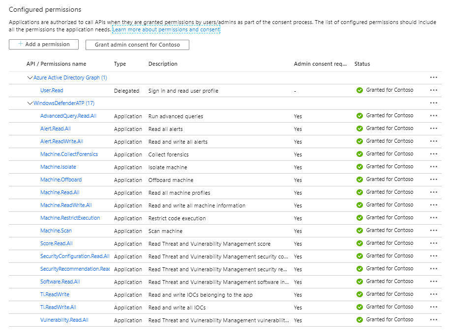

# Microsoft Defender Advanced Threat Protection PowerShell Module

[](https://github.com/PowerShell/PowerShell) 

<p align="center">
    
</p>

Welcome to the Microsoft Defender Advanced Threat Protection PowerShell module!

This module is a collection of easy-to-use cmdlets and functions designed to make it easy to interface with the Microsoft Defender Advanced Threat Protection API.

## Motivation

I created this PowerShell module for MDATP for the following reasons:

1. Advance my PowerShell skills
2. Provide an easy way to interact with MDATP through PowerShell because I prefer automation over manual tasks

## Prerequisites

- Windows PowerShell 5.1 (Testing for PowerShell 7 is in progress)
- have configured authorization for access by registering an application in AzureAD

### App Permissions

Below is an example of the App Permissions that you must grant. I will provide more details soon about the individual cmdlets and the permissions required

<p align="center">
    
</p>


## Getting Started

To get started with the module, open your PowerShell terminal and install the module from the PSGallery by running this simple command:
```powershell
Install-Module PSMDATP -Scope CurrentUser
```
## App Registration

## Initial Configuration

When you have installed the module and registered the App in AzureAD, you will find a file **TEMPLATE_PoshMTPconfig.json** in the Module folder. Rename this file to **PoshMTPConfig.json** and enter your API settings. Then copy the file in the root of the Module folder.

***Example:***

```powershell
"C:\Users\User1\Documents\WindowsPowerShell\Modules\PSMDATP"
───PSMDATP
│   │   PoshMTPconfig.json
│   │
│   └───0.0.1
│           PSMDATP.psd1
│           PSMDATP.psm1
│           TEMPLATE_PoshMTPconfig.json
```

At present the PSMDATP PowerShell module only requires the API_MDATP information

```json
{
    "API_MDATP":  {
                      "AppName":  "WindowsDefenderATPPSMDATP",
                      "OAuthUri":  "https://login.windows.net/<YOUR TENANT ID>/oauth2/token",
                      "ClientID":  "CLIENT ID",
                      "ClientSecret":  "<CLIENT SECRET>"
                  },
    "API_MSGRAPH":  {
                        "AppName":  "xMSGraph",
                        "OAuthUri":  "https://login.windows.net/<YOUR TENANT ID>/oauth2/token",
                        "ClientID":  "<CLIENT ID>",
                        "ClientSecret":  "<CLIENT SECRET>"
                    }
}
```

## Important

I am going to assume that you are familiar with MDATP as such and understand the consequences of triggering actions on devices. Where applicable the cmdlets support the use the ***-whatif*** parameter. Think before pressing the key!

## Running your first commands

### List included cmdlets

Let's first take a look at the cmdlets included in the PSMDATP Module

```powershell
get-command -Module PSMDATP | Select Name
```

You will see something like this
```powershell
Add-MDATPDeviceTag
Get-MDATPAlert
Get-MDATPCollectionPackageUri
Get-MDATPDevice
Get-MDATPDeviceAction
Get-MDATPDeviceTag
Get-MDATPIndicator
Get-MDATPInvestigation
Get-MDATPQuery
Remove-MDATPDevice
Remove-MDATPDeviceTag
Start-MDATPAppRestriction
Start-MDATPAVScan
Start-MDATPInvestigation
Start-MDATPInvestigationPackageCollection
Start-MDATPIsolation
Stop-MDATPAppRestriction
Stop-MDATPIsolation
```

For more details about the cmdlets included in this module check out the [cmdlets documentation page](.(../../docs/PSMDATP.md)

### Retrieve MDATP Alerts

Run the following command to retrieve alerts from the past 30 days

```powershell
Get-MDATPAlert -PastHours 720
```

### List MDATP Devices

Run the following command to list all MDATP registered devices

```powershell
Get-MDATPDevice -All
```

## Contributing

If you have an idea or want to contribute to this project please submit a suggestion

## Authors

**Alex Verboon** [Twitter](https://twitter.com/alexverboon)

## TODO

I have the following on my to-do list:

- A better solution to store the API configuration in a more secure place
- Add cmdlets for TVM
- Add cmdlets to manage custom indicators
- Add more query templates for advanced hunting
- Create more Module related Pester tests